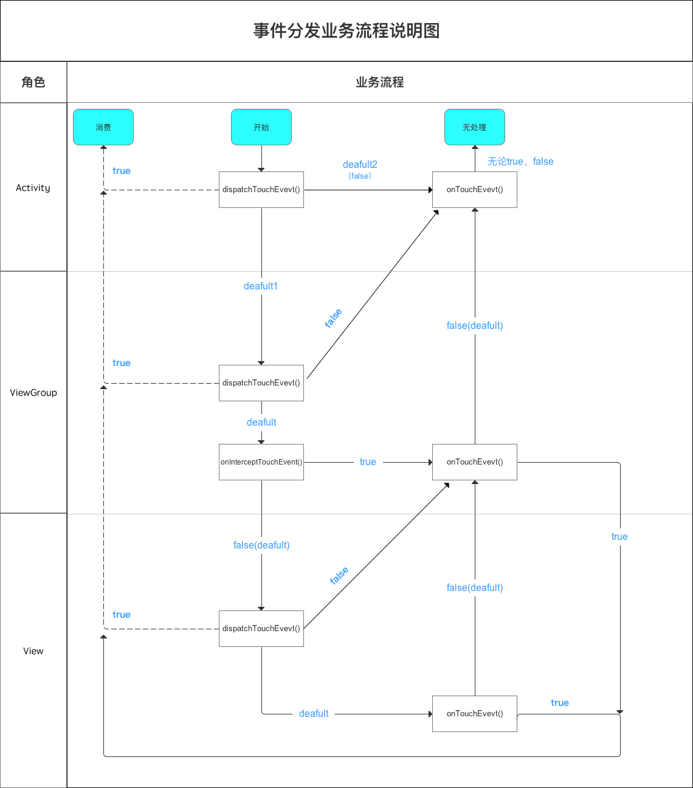

[TOC]

# 一、Android事件分发机制结论



从上面图可以看出，事件从Activity开始一层层往下分发(```dispatchTouchEvent()```)，到最后一层View/ViewGroup后，如果不消耗(```onTouchEvent()``` 返回 false)，则将事件交与上层View处理，这样一直传递到消耗事件的View或者直到Activity的```onTouchEvent()``` 为止。

这样也符合我们使用场景，我们点击屏幕某一个地方，一般是看到某个标示物进行点击，最开始应该是最接近这个标示物的地方响应我们的点击事件，然后再一层层扩大范围，即：***事件优先于交给最下层的View处理，如果不处理，则事件再一层层往上传递***


* 事件分发的三个阶段
  * 分发 ```dispatchTouchEvent```
  * 拦截 ```onInterceptTouchEvent```
  * 消耗 ```onTouchEvent```


# 二、重要方法说明

## 2.1 ViewGroup.dispatchTouchEvent()

* 先判断该```ViewGroup```是否拦截事件，即：```onInterceptTouchEvent()```返回值，
  * true表示拦截，之后事件会交给该```ViewGroup```的 ```onTouchEvent()```处理，并且该```ViewGroup```其他子```View```无法获取到事件
  * false表示不拦截，事件会继续分发给该```ViewGroup```的其他子```View```，调用子```View```的```dispatchTouchEvent()```方法

## 2.2 ViewGroup.onInterceptTouchEvent()

```ViewGroup```默认返回false，即不拦截事件，我们可以通过复写```onInterceptTouchEvent()```方法来拦截事件

## 2.3 View.dispatchTouchEvent()

* 先判断```onTouch()```方法是否拦截（返回值为true表示拦截），如果拦截，则 ```dispatchTouchEvent()```方法返回true，表示该```View```消耗了该事件
* 如果```onTouch()```方法不拦截，则判断```onTouchEvent()```方法是否拦截，如果拦截，则```dispatchTouchEvent()```方法返回true，表示该```View```消耗了该事件

## 2.4 View.onTouchEvent()

* 返回true，表示消耗该事件。此时事件将不再向上层```ViewGroup```传递
* 返回false，表示不消耗该事件。此时事件继续向上层```ViewGroup```传递

# 三、源码分析

***注：此处源码基于Android9.0***

## 3.1 事件传递流程

```java
Activity.dispatchTouchEvent() =>
  PhoneWindow.superDispatchTouchEvent() =>
  	DecorView.superDispatchTouchEvent() =>
  		ViewGroup.dispatchTouchEvent()
//此处方法较为简单，不做过多分析
```

### 3.1.1 Activity.dispatchTouchEvent()

```java
		public boolean dispatchTouchEvent(MotionEvent ev) {
        if (ev.getAction() == MotionEvent.ACTION_DOWN) {
            onUserInteraction();
        }
        //window实现类为PhoneWindow，所以最终会调用PhoneWindow.superDispatchTouchEvent()方法
        if (getWindow().superDispatchTouchEvent(ev)) {
            return true;
        }
        //如果事件没有处理，及getWindwo().superDispatchTouchEvent()返回false
        //则事件最终会交给Activity.onTouchEvent()处理，默认返回false
        return onTouchEvent(ev);
    }
```

### 3.1.2 PhoeWindow.superDispatchTouchEvent()

```java
		@Override
    public boolean superDispatchTouchEvent(MotionEvent event) {
        //mDecor是DecorView的实例，继续看DecorView.superDispatchTouchEvent()
        return mDecor.superDispatchTouchEvent(event);
    }
```

### 3.1.3 DecorView.superDispatchTouchEvent()

```java
		public boolean superDispatchTouchEvent(MotionEvent event) {
        //DecorView继承自FrameLayout，而FrameLayout继承自ViewGroup
        //super.dispatchTouchEvent()方法为调用的ViewGroup的方法
        return super.dispatchTouchEvent(event);
    }
```

## 3.2 ViewGroup.dispatchTouchEvent()源码

```java
		@Override
    public boolean dispatchTouchEvent(MotionEvent ev) {
      
      //......
      
      boolean handled = false;
      if (onFilterTouchEventForSecurity(ev)) {
        		// Check for interception.
            final boolean intercepted;
            if (actionMasked == MotionEvent.ACTION_DOWN
                    || mFirstTouchTarget != null) {
                final boolean disallowIntercept = (mGroupFlags & FLAG_DISALLOW_INTERCEPT) != 0;
                if (!disallowIntercept) {
                    //表示该ViewGroup是否拦截，当intercepted为true时，表示拦截
                    //则下面将不会继续把事件分发到子View中
                    intercepted = onInterceptTouchEvent(ev);
                    ev.setAction(action); // restore action in case it was changed
                } else {
                    intercepted = false;
                }
            } else {
                // There are no touch targets and this action is not an initial down
                // so this view group continues to intercept touches.
                intercepted = true;
            }
        
          	//......
        
          	// Check for cancelation.
          	final boolean canceled = resetCancelNextUpFlag(this)
                  	|| actionMasked == MotionEvent.ACTION_CANCEL;
        		// Update list of touch targets for pointer down, if needed.
            final boolean split = (mGroupFlags & FLAG_SPLIT_MOTION_EVENTS) != 0;
            TouchTarget newTouchTarget = null;
            boolean alreadyDispatchedToNewTouchTarget = false;
            //intercepted为false表示不拦截，则会继续将事件向子View往下分发
            if (!canceled && !intercepted) {
              
              //此处会进行一系列判读，例如点击区域是否包含在该子View中等
              //......
              
              //此处child不为null，在dispatchTransformedTouchEvent()中会调用
              //child.dispatchTouchEvent()，即将事件传递给子View
              //见下面dispatchTrannsformedTouchEvent()方法详细分析
              if (dispatchTransformedTouchEvent(ev, false, child, idBitsToAssign)) {
                //......
              }
            }
        
            //mFirstTouchTarget赋值是在if(!canceld && !intercepted){}代码中的
            //所以，如果该ViewGroup拦截了点击事件，则会执行下面的dispatchTransformedTouchEvent()
            //此处传入的child值为null，则会执行super.dispatchTouchEvent()，即调用父类
            //View.dispatchTouchEvent()，执行自己的onTouchEvent()方法
            //见下面dispatchTransformedTouchEvent()方法详细分析
            // Dispatch to touch targets.
            if (mFirstTouchTarget == null) {
                // No touch targets so treat this as an ordinary view.
                handled = dispatchTransformedTouchEvent(ev, canceled, null,
                        TouchTarget.ALL_POINTER_IDS);
            } else {
              //......
            }
        
            //......
        
            return handled;
      }
    }
```


* ```dispatchTransformedTouchEvent()```

```java
		private boolean dispatchTransformedTouchEvent(MotionEvent event, boolean cancel,
            View child, int desiredPointerIdBits) {
        final boolean handled;
      
      	//......
      
      	// Perform any necessary transformations and dispatch.
        if (child == null) {
            //如果child为null，则调用super.dispatchTouchEvent()
            //即调用View.dispatchTouchEvent()
            handled = super.dispatchTouchEvent(transformedEvent);
        } else {
            final float offsetX = mScrollX - child.mLeft;
            final float offsetY = mScrollY - child.mTop;
            transformedEvent.offsetLocation(offsetX, offsetY);
            if (! child.hasIdentityMatrix()) {
                transformedEvent.transform(child.getInverseMatrix());
            }

            //如果child != null，则调用child.dispatchTouchEvent()
            //继续向下分发事件
            handled = child.dispatchTouchEvent(transformedEvent);
        }

        // Done.
        transformedEvent.recycle();
        return handled;
    }
```


## 3.3 ViewGroup.onInterceptTouchEvent

```java
		public boolean onInterceptTouchEvent(MotionEvent ev) {
        if (ev.isFromSource(InputDevice.SOURCE_MOUSE)
                && ev.getAction() == MotionEvent.ACTION_DOWN
                && ev.isButtonPressed(MotionEvent.BUTTON_PRIMARY)
                && isOnScrollbarThumb(ev.getX(), ev.getY())) {
            return true;
        }
        //上面为一些特殊情况判断
        //方法默认实现返回false
        return false;
    }
```


## 3.4 View.dispatchTouchEvent()

```java
		//此处可以看到，View.dispatchTouchEvent()方法只会执行onTouch/onTouchEvent方法消耗事件
    //不会再向下传递事件（onTouch/onTouchEvent返回true，表示消耗事件；false表示不消耗）
    //dispatchTouchEvent返回消耗结果，true时，表示该View消耗掉事件；false表示不消耗
    //上层调用该方法会进行判断，此处为true时，则不会继续执行（事件向上传递）；false时会继续执行上层
    //的onTouch/onTouchEvent方法
		public boolean dispatchTouchEvent(MotionEvent event) {
  			//......
  			boolean result = false;
      	//......
  			if (onFilterTouchEventForSecurity(event)) {
            if ((mViewFlags & ENABLED_MASK) == ENABLED && handleScrollBarDragging(event)) {
                result = true;
            }
            //先判断onTouch是否消耗事件，不消耗则继续判断
            //noinspection SimplifiableIfStatement
            ListenerInfo li = mListenerInfo;
            if (li != null && li.mOnTouchListener != null
                    && (mViewFlags & ENABLED_MASK) == ENABLED
                    && li.mOnTouchListener.onTouch(this, event)) {
                result = true;
            }

            //onTouch不消耗时，则会进一步判断onTouchEvent是否消耗
            //此处可以看到onTouch会先执行，并且可以拦截掉onTouchEvent的事件
            if (!result && onTouchEvent(event)) {
                result = true;
            }
        }
      
      //......
      
      return result;
}
```


# 四、总结

* Activity

  Activity只有```dispatchTouchEvent```和```onTouchEvent```方法，只能分发事件和消耗事件，不可以拦截事件

* ViewGroup

  ViewGroup有```dispatchTouchEvent() onInterceptTouchEvent() onTouchEvent()```，可以向下分发事件，可以拦截事件，也可以自己消耗事件

* View只有```dispatchTouchEvent()```和```onTouchEvent()```方法，只可以分发事件和消耗事件

事件分发的流程伪代码表示：

```java
public boolean diapatchTouchEvent(MotionEvent ev) {
    boolean consume = false;
    if (onInterceptTouchEvent(ev)) {
        consume = onTouchEvent(ev);
    } else {
        consume = child.dispatchTouchEvent(ev);
    }
    return consume;
}
```

