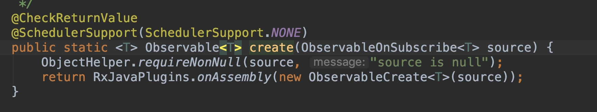
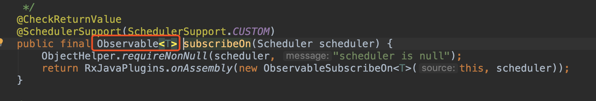
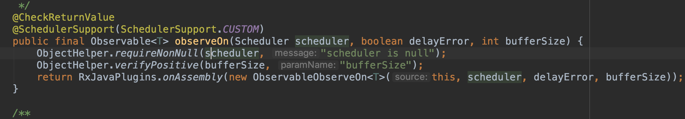
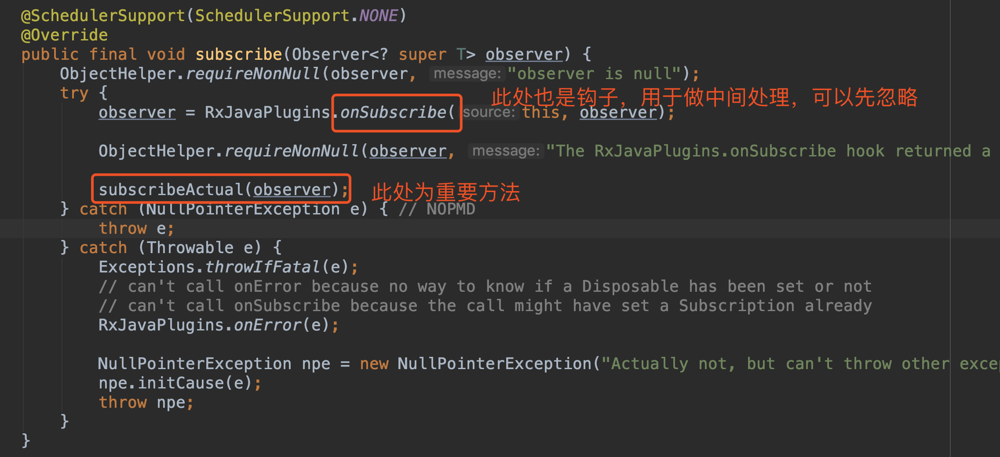

[TOC]

版本信息：

```gro
		//retrofit
    api 'com.squareup.retrofit2:retrofit:2.4.0'
    api 'com.squareup.retrofit2:converter-gson:2.4.0'
    //rxjava
    api 'io.reactivex.rxjava2:rxjava:2.2.3'
    api 'io.reactivex.rxjava2:rxandroid:2.1.0'
    api 'com.squareup.retrofit2:adapter-rxjava2:2.4.0'
```


# 一、分析入口，以Android开发中最常见的代码片段为例

```java
public static void createOperator() {
        Observable.create(new ObservableOnSubscribe<String>() {
            @Override
            public void subscribe(ObservableEmitter<String> emitter) throws Exception {
                //IO Thread
                System.out.println("subscribe : " + Thread.currentThread().getName());
                //Thread.sleep(1000);
                emitter.onNext("this is form subscribe method");
                emitter.onComplete();
            }
        }).subscribeOn(Schedulers.io())
                .observeOn(AndroidSchedulers.mainThread())
                .subscribe(new Observer<String>() {
                    @Override
                    public void onSubscribe(Disposable d) {
                        /*
                         * main 应该是使用RxJava当前运行的线程
                         * 执行顺序：onSubscribe -> subscribe -> onNext
                         */
                        System.out.println("onSubscribe : " + Thread.currentThread().getName());
                    }

                    @Override
                    public void onNext(String s) {
                        // main
                        System.out.println("onNext : " + Thread.currentThread().getName());
                    }

                    @Override
                    public void onError(Throwable e) {

                    }

                    @Override
                    public void onComplete() {

                    }
                });
    }
```

在自线程中做一些耗时操作，处理结束后，在主线程中调用```onNext``` 和 ```onComplete``` 方法

# 二、自己实现类似功能，Android代码片段

```java
public class MockCreate {

    private Handler mHandler = new Handler(Looper.getMainLooper());

    interface Callback {
        void onSuccess();
        void onFail();
    }

    public void mockCreateOperator(final Callback callback) {
        new Thread(new Runnable() {
            @Override
            public void run() {
                timeConsuming();

                //耗时操作执行结束，通过主线程回调通知
                mHandler.post(new Runnable() {
                    @Override
                    public void run() {
                        callback.onSuccess();

                        //耗时操作执行失败时回调这个方法
                        //callback.onFail();
                    }
                });
            }
        }).start();
    }

    public void timeConsuming() {
        //一些耗时操作
        try {
            Thread.sleep(2000);
        } catch (InterruptedException e) {
            e.printStackTrace();
        }
    }

}
```

# 三、分析RxJava Create 操作符

可以看到 ```create/subscribeOn/observeOn``` 都返回 ```Observalbe``` 对象，先忽略 ```RxJavaPlugins.onAssembly(...)``` ，只是一个勾子，方便中间做一些特殊处理。







我们一层层分析，先看下 ```subscribe(Observable)``` 方法



之后我们一层层往上看

## 1、observeOn(AndroidSchedulers.mainThread())

```observeOn``` 方法返回 ```ObservableObserveOn``` 对象，我们看下该对象的 ```subscribeActual``` 方法

```java
		public ObservableObserveOn(ObservableSource<T> source, Scheduler scheduler, boolean delayError, int bufferSize) {
        super(source);
        this.scheduler = scheduler;
        this.delayError = delayError;
        this.bufferSize = bufferSize;
    }

    @Override
    protected void subscribeActual(Observer<? super T> observer) {
        if (scheduler instanceof TrampolineScheduler) {
            source.subscribe(observer);
        } else {
          	//使用AndroidSchedulers.mainThread()方法的sceduler创建worker对象
            Scheduler.Worker w = scheduler.createWorker();
						
          	//使用上一个Observable对象继续调用subscribe方法，即上一个的subcribeActual方法
            source.subscribe(new ObserveOnObserver<T>(observer, w, delayError, bufferSize));
        }
    }
```

从上面注释中可以看出，接下来会执行 ```subscribeOn``` 方法返回对象的 ```Obserbable.subscribeActual``` 方法

## 2、subcribeOn(Schedulers.io())

同样，我们看 ```ObservableSubscribeOn``` 对象的 ```subscribeActual``` 方法

```java
@Override
public void subscribeActual(final Observer<? super T> observer) {
    final SubscribeOnObserver<T> parent = new SubscribeOnObserver<T>(observer);

    observer.onSubscribe(parent);

    parent.setDisposable(scheduler.scheduleDirect(new SubscribeTask(parent)));
}
```

这里做了两件事，第一：调用了```observer.onSubscribe(parent)```；第二：调用 ```scheduler.scheduleDirect()``` ，由于我们使用的是 ```Schedulers.io()```，通过源码一步步点进去（中间大多是在做一些钩子处理），可以追溯到```IoScheduler``` 这个类，通过查看知道 ```scheduleDirect``` 位于 ```Scheduler```中，代码片段如下：

```java
@NonNull
public Disposable scheduleDirect(@NonNull Runnable run, long delay, @NonNull TimeUnit unit) {
    //创建worker，主要看scheduler实现类的该方法
  	final Worker w = createWorker();

    final Runnable decoratedRun = RxJavaPlugins.onSchedule(run);

    DisposeTask task = new DisposeTask(decoratedRun, w);

  	//调用workder的schedule方法
    w.schedule(task, delay, unit);

    return task;
}
```

接下来我们看 ```IoScheduler``` 的 ```createWorker()``` 方法。

```java
@NonNull
@Override
public Worker createWorker() {
    return new EventLoopWorker(pool.get());
}
```

继续看 ```EventLoopWorker``` 的 ```schedule()``` 方法（ ```w.schedule(task, delay, unit);```）

```java
@NonNull
@Override
public Disposable schedule(@NonNull Runnable action, long delayTime, @NonNull TimeUnit unit) {
    if (tasks.isDisposed()) {
        // don't schedule, we are unsubscribed
        return EmptyDisposable.INSTANCE;
    }

    return threadWorker.scheduleActual(action, delayTime, unit, tasks);
}
```

继续追溯 ```threadWorkder.scheduleActual(…)``` 方法

```java
@NonNull
public ScheduledRunnable scheduleActual(final Runnable run, long delayTime, @NonNull TimeUnit unit, @Nullable DisposableContainer parent) {
    Runnable decoratedRun = RxJavaPlugins.onSchedule(run);

    ScheduledRunnable sr = new ScheduledRunnable(decoratedRun, parent);

    if (parent != null) {
        if (!parent.add(sr)) {
            return sr;
        }
    }

    Future<?> f;
    try {
      	//这里的executor为java中ScheduledExecutorService对象的实例
      	//该处实现了定时执行或者立即执行的功能
      	//此处可以看到subcribeOn(Schedulers.io())会直接调用observer的onSubscribe方法
      	//onSubscribe方法执行线程为注册时的线程，而之后操作是在Schedulers.io()指定的子线程中执行的
        if (delayTime <= 0) {
            f = executor.submit((Callable<Object>)sr);
        } else {
            f = executor.schedule((Callable<Object>)sr, delayTime, unit);
        }
        sr.setFuture(f);
    } catch (RejectedExecutionException ex) {
        if (parent != null) {
            parent.remove(sr);
        }
        RxJavaPlugins.onError(ex);
    }

    return sr;
}
```

到这里我们看到了通过 ```subscribeOn(Schedulers.io())``` 使得 ```create``` 操作符的 ```subscribe``` 方法在子线程中执行。因为上面我们看到了是通过 ```executor``` 来执行传入的 ```Runnable``` 对象的，而该对象如下：

```java
//scheduler.scheduleDirect(new SubscribeTask(parent))，以下代码位于ObservableSubscribeOn中
final class SubscribeTask implements Runnable {
    private final SubscribeOnObserver<T> parent;

    SubscribeTask(SubscribeOnObserver<T> parent) {
        this.parent = parent;
    }

    @Override
    public void run() {
      	//可以看出继续调用上面Observable的subscribe方法
        source.subscribe(parent);
    }
}
```

如果继续追溯可以到 ```ObservableCreate``` 类中，该类的 ```subscribeActual``` 方法是在 ```executor``` 中执行的

```java
@Override
protected void subscribeActual(Observer<? super T> observer) {
	  CreateEmitter<T> parent = new CreateEmitter<T>(observer);
    observer.onSubscribe(parent);

    try {
      	//通过以上分析，可以知道，subscribeOn(Schedulers.io())后，该方法是在子线程中运行的
        source.subscribe(parent);
    } catch (Throwable ex) {
        Exceptions.throwIfFatal(ex);
        parent.onError(ex);
    }
}
```

3、接下来我们看如何实现回调时是在Android主线程的

我们继续回到 ```ObservableObserveOn``` 类的 ```subscribeActual``` 方法

```java
@Override
protected void subscribeActual(Observer<? super T> observer) {
    if (scheduler instanceof TrampolineScheduler) {
        source.subscribe(observer);
    } else {
        Scheduler.Worker w = scheduler.createWorker();

      	//虽然通过上个Obserbable的subscribe方法将observer传递过去，但是observer是经过封装了一层的
      	//在创建ObserverOnObserver对象时会把worker传入，
      	//这里的worker是通过AndroidSchedulers.mainThread()创建的
        source.subscribe(new ObserveOnObserver<T>(observer, w, delayError, bufferSize));
    }
}
```

我们继续看 ```ObserveOnObserver``` 都做了哪些处理，这里仅展示 ```onNext``` 代码片段，其他回调类似

```java
@Override
public void onNext(T t) {
    if (done) {
        return;
    }

    if (sourceMode != QueueDisposable.ASYNC) {
        queue.offer(t);
    }
  	//主要看这个方法，
    schedule();
}
```

其他几个回调也会调用 ```schedule``` 方法：

```java
void schedule() {
    if (getAndIncrement() == 0) {
      	//通过创建的worker调用schedule方法
        worker.schedule(this);
    }
}
```

我们通过定位```AndroidSchedulers.mainThread()``` 的对象，可以看到 ```HandlerScheduler```，创建该对象时将```new Handler(Looper.getMainLooper())``` 传入，该对象可以往主线程发送消息，放到主线程中执行。继续看创建的 ```worker``` 对象：

```jav
@Override
public Worker createWorker() {
    return new HandlerWorker(handler, async);
}
```

继续看 ```HandlerWorkder``` 的 ```schedule``` 方法：

```java
@Override
@SuppressLint("NewApi") // Async will only be true when the API is available to call.
public Disposable schedule(Runnable run, long delay, TimeUnit unit) {
    if (run == null) throw new NullPointerException("run == null");
    if (unit == null) throw new NullPointerException("unit == null");

    if (disposed) {
        return Disposables.disposed();
    }

  	//schedule方法的第一个参数run，就是ObserveOnObserver对象
    run = RxJavaPlugins.onSchedule(run);

    ScheduledRunnable scheduled = new ScheduledRunnable(handler, run);

    Message message = Message.obtain(handler, scheduled);
    message.obj = this; // Used as token for batch disposal of this worker's runnables.

    if (async) {
         message.setAsynchronous(true);
    }
		//可以看出此处将回调放到了Android主线程中去执行
    handler.sendMessageDelayed(message, unit.toMillis(delay));

    // Re-check disposed state for removing in case we were racing a call to dispose().
    if (disposed) {
        handler.removeCallbacks(scheduled);
        return Disposables.disposed();
    }

    return scheduled;
}
```

我们继续看 ```ObserveOnObserver``` 对象的 ```run``` 方法：

```java
@Override
public void run() {
    if (outputFused) {
       drainFused();
    } else {
        drainNormal();
    }
}
```

继续往下看可以看到 ```drainFused()/drainNormal()``` 中会执行回调的方法。到此就分析了 ```create``` 操作符在Android中常见用法的执行流程

